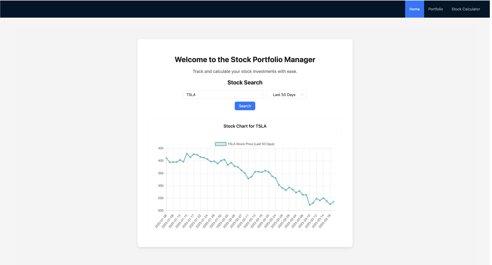
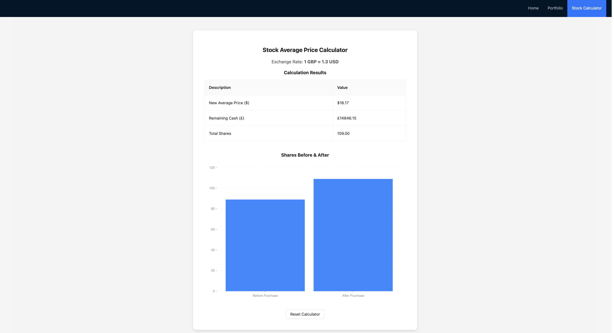
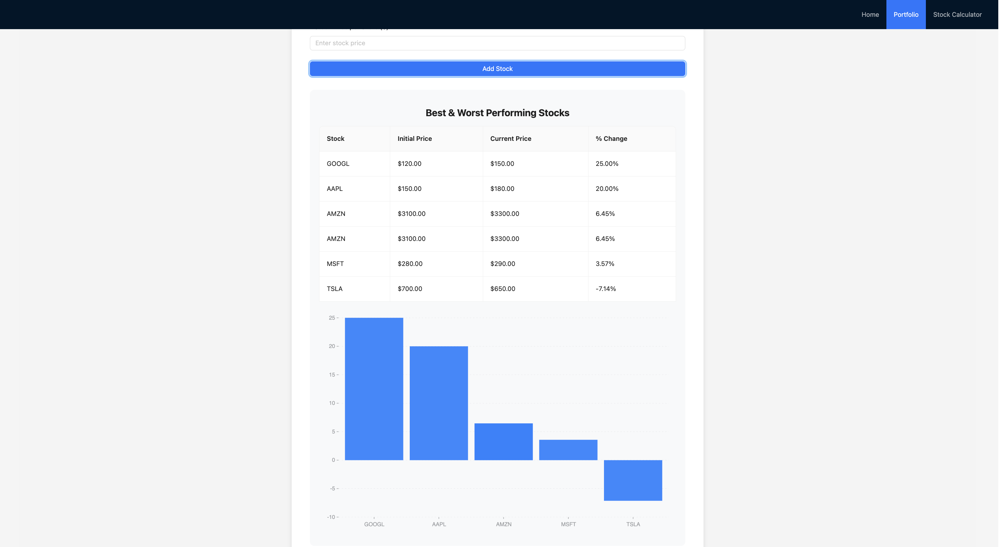

# 📈 Stock Portfolio Manager

## 📌 Overview

The **Stock Portfolio Manager** is a React-based web application that allows users to:

- 🔍 **Search for stock information** using the **Financial Modeling Prep (FMP) API**.
- 📊 **View and filter stock price charts** for a selected number of days.
- 🧮 **Use a stock calculator** to determine how many shares they can buy and calculate their new average price.
- 🥧 **Visualize portfolio allocation** with a pie chart displaying investments vs. free cash.
- 📈 **Manage their stock portfolio** by adding stocks and analyzing performance.
- 📊 **View detailed insights** on portfolio performance, including best & worst performers and portfolio distribution by sector.

## 🚀 Features

- **Stock Search** – Search for real-time stock prices using FMP API.
- **Stock Chart** – View and filter stock price trends for a custom time range.
- **Stock Calculator** – Calculate potential purchases and track average cost per share.
- **Portfolio Management** – Add stocks, track holdings, and analyze performance.
- **Portfolio Insights** – Charts displaying best/worst performers and sector-based allocation.
- **News Section** – Fetches the latest financial news from FMP API.

## 🛠️ Tech Stack

- **Frontend:** React, Ant Design, Chart.js
- **API:** Financial Modeling Prep (FMP) API
- **Styling:** CSS, Ant Design

## 📦 Installation

1. Clone the Repository:  
   `git clone https://github.com/Jfloyd7720/Stock-Portfolio-Tracker.git`

2. Navigate to the Project Directory:  
   `cd Stock-Portfolio-Tracker`

3. Install Dependencies:  
   `npm install`

4. Start the Development Server:  
   `npm start`

## 📸 Screenshots

---
